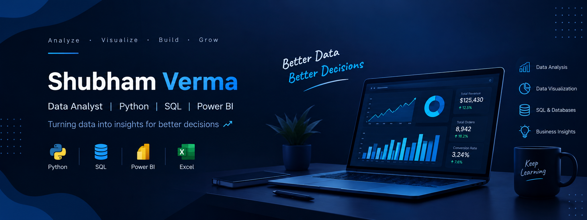

  

## 👋 About Me

I’m a B.Tech student and aspiring Data Analyst focused on turning data into meaningful insights and business decisions.

- 📊 Building interactive dashboards and data analysis projects
- 🐍 Working with Python, Pandas, and NumPy
- 🗄️ Using SQL and MySQL for data querying and analysis
- 📈 Creating dashboards with Power BI, DAX, and Excel
- 🚀 Continuously improving my skills through practical projects

## 🛠️ Technical Skills

### 📊 Data Analysis
`Python` `Pandas` `NumPy` `SQL`

### 📈 Business Intelligence & Visualization
`Power BI` `DAX` `Excel` `Matplotlib`

### 🗄️ Database & Tools
`MySQL` `Git` `GitHub` `Jupyter Notebook`

## 📊 Featured Projects

### 🛒 [Amazon Sales Dashboard](https://github.com/Shubham-Verma607/amazon-sales-dashboard)
Interactive Power BI dashboard for analyzing sales performance, profitability, products, customers, payment modes, and shipping trends.

**Tools:** `Power BI` `DAX` `Power Query` `Data Visualization`

---

### 📱 [Mobile Product Sales Dashboard](https://github.com/Shubham-Verma607/mobile-product-sales-dashboard)
Interactive Power BI dashboard focused on mobile product sales analysis, KPIs, product performance, and business insights.

**Tools:** `Power BI` `DAX` `Power Query` `Data Analysis`

---

### 🌾 GramSathi-AI
AI-powered smart farming assistant designed to provide intelligent and data-driven agricultural support.

**Focus:** `AI` `Flask` `Python` `Web Application`
## 🎯 Currently Learning

- Advanced SQL
- Data Cleaning & Analysis
- Power BI & DAX
- Data Visualization
- Real-world Data Analytics

---

## 💡 Areas of Interest

- Data Analytics
- Business Intelligence
- Data Visualization
- Python & SQL
- AI-powered applications

---

## 📬 Open to Opportunities

Interested in opportunities related to:

- Data Analytics
- Business Intelligence
- Power BI
- Python & SQL
- Data Visualization

---
## 🤝 Connect With Me

**LinkedIn:** [Shubham Verma](https://www.linkedin.com/in/shubhamverma234/)  
**GitHub:** [Shubham-Verma607](https://github.com/Shubham-Verma607)

---

